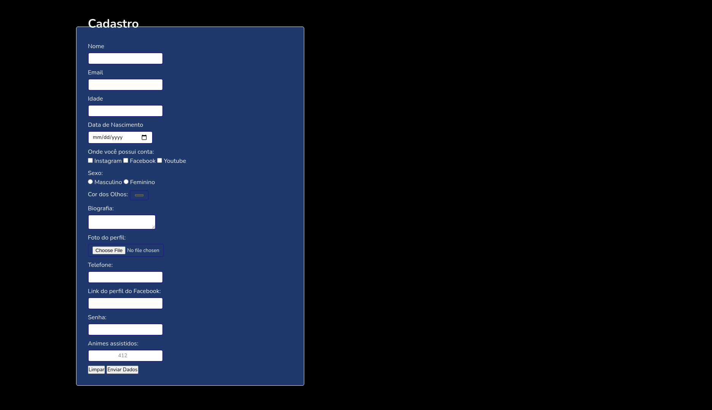

<h1>
    Form - DevClub Challenge 2
</h1>

## About

DevClub introductory challenge to HTML and CSS

## Result

Access the project <a href="https://luk4x.github.io/DevClub-Desafio2-Formulario/" target="_blank">HERE</a>.

## 🤝 Contributors Linkedin
<table>
  <tr>
    <td align="center">
      <a href="https://www.linkedin.com/in/lucasmacielf/">
         
        
          <b>Lucas Maciel</b>
        
      </a>
    </td>
  </tr>
</table>
